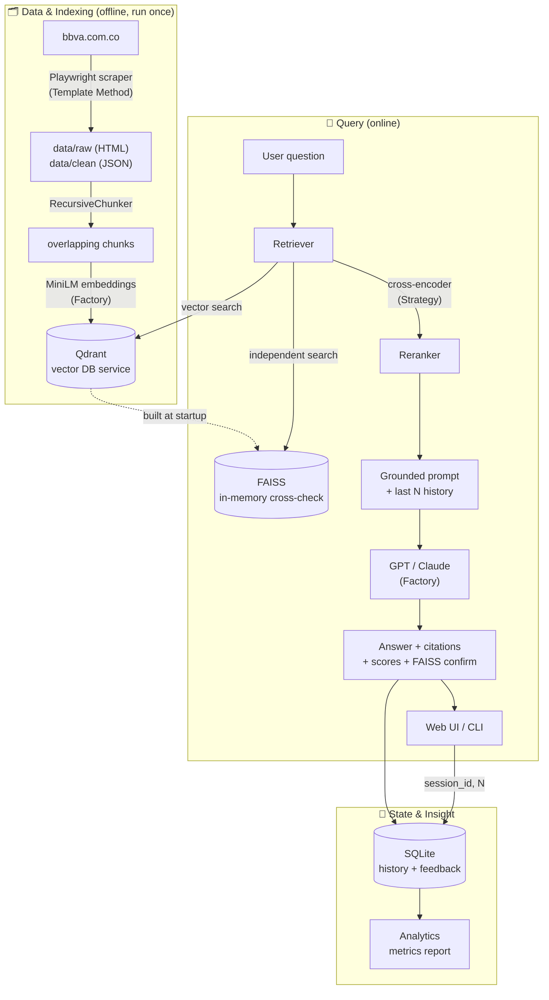

# Architecture & Design Decisions

End-to-end architecture of the BBVA RAG Assistant, the technology selected at
each layer, and the reasoning behind each choice.

## System diagram

## Pipeline in one line

**scrape → store raw+clean → chunk → embed → index (Qdrant) → retrieve → FAISS
cross-check → rerank → grounded generation (GPT) → cited answer + scores →
persist history → analytics.**

## Retrieval & answer logic

How a question becomes a grounded answer:

1. **Embed** the question (local MiniLM) and run a **wide vector recall** in Qdrant (top-k candidates).
2. **FAISS cross-check** runs the same query on an independent in-memory index and confirms Qdrant's top hit (agreement shown in the UI).
3. **Rerank** the candidates with a cross-encoder and keep the best few (precision stage).
4. **Confidence & out-of-scope gate:** confidence is derived from the top similarity. If nothing clears `SIMILARITY_THRESHOLD`, the system returns a refusal **without calling the LLM** — no token spend, no answering from model memory.
5. **Grounded generation:** the LLM receives the reranked context + the last **N** history messages and must answer **only** from that context, in plain text, citing `[Fuente: URL]`.
6. **Guardrails:** the prompt treats retrieved context as *data, not instructions* (prompt-injection safety) and does not reveal its instructions.
7. **Persist & measure:** both turns are saved to SQLite with metadata (confidence, cosine + rerank scores, latency, FAISS agreement); the analytics module aggregates it.

Every parameter above — N, top-k, threshold, model, reranker on/off, FAISS on/off — is externalized in `.env`.

## Technology selection & rationale

| Layer | Choice | Alternatives considered | Why this choice |
|---|---|---|---|
| **Language** | Python 3.12 | — | Required; best ML/RAG ecosystem. |
| **Scraper** | Playwright (headless Chromium) | requests/BeautifulSoup, Scrapy | BBVA is JS-rendered behind Akamai; a static GET returns an empty 403 shell. A real browser (+ stealth headers) is the only reliable path. A stdlib HTTP fallback is included. |
| **Local storage** | raw HTML + clean JSON on disk | single store | Requirement asks for *crudos y limpios*; keeping both allows re-cleaning without re-scraping. |
| **Chunking** | RecursiveChunker (800/120) | fixed-size, token splitter | Boundary-aware (paragraph→sentence→word) keeps one topic per chunk → better retrieval precision. |
| **Embeddings** | `all-MiniLM-L6-v2` (local) | OpenAI embeddings, multilingual MiniLM | Free, CPU, no API cost; normalized → cosine = dot product. Multilingual model documented as a recommended upgrade for Spanish. |
| **Vector DB** | **Qdrant** (service) | FAISS, Chroma, pgvector, Pinecone | A real, self-hosted vector-DB **service** (fits the "compose brings up the DB" requirement), cosine search, metadata payloads for citations/filtering, free. |
| **Retrieval confirmation** | **FAISS** in-memory cross-check | — | Independent engine over the *same* vectors confirms Qdrant's top hit per query — a robustness/consistency signal shown in the UI. |
| **Reranker** (bonus) | cross-encoder `ms-marco-MiniLM-L-6-v2` | none, LLM re-rank | Joint (query, chunk) scoring is far more precise than bi-encoder recall; free/local. Behind a Strategy so it can be disabled. |
| **LLM** | **GPT** (`gpt-4o-mini`), swappable | Claude, local (Ollama) | Strong grounded/cited answers; cheap. Behind a Factory → `LLM_PROVIDER` swaps to Claude or a free local model with no code change. |
| **Memory** | SQLite | Redis, Postgres | Persists history + feedback by `session_id`, zero extra services, queryable by analytics. |
| **API** | FastAPI + Uvicorn | Flask | Async, native SSE streaming, Pydantic validation, auto OpenAPI docs. |
| **Frontend** | single-file HTML/JS | React | Minimal, no build step; streams tokens, shows sources + scores + FAISS badge. |
| **Orchestration** | Docker Compose | — | One command brings up app + Qdrant. |
| **Config** | Settings Singleton + `.env` | scattered os.getenv | One env-driven source of truth; every parameter externalized. |

## Design patterns (where & why)

| Pattern | Location | Why |
|---|---|---|
| **Singleton** | `src/config.py` | one immutable, process-wide config read once from env |
| **Factory Method** | `EmbedderFactory`, `LLMFactory` | swap embedding model / LLM provider from config only |
| **Template Method** | `BaseScraper.run()` | fixed crawl/persist algorithm; only `fetch()` varies per subclass |
| **Strategy** | `Reranker` (NoOp / CrossEncoder) | interchangeable rerank algorithm selected from config |
| **Repository** | `VectorStore` / `QdrantVectorStore` | storage-agnostic interface; swap the DB without touching callers |

See the [main README](../README.md) for full pattern write-ups and the
[cost model](COSTS.md) for the economics of this solution.
